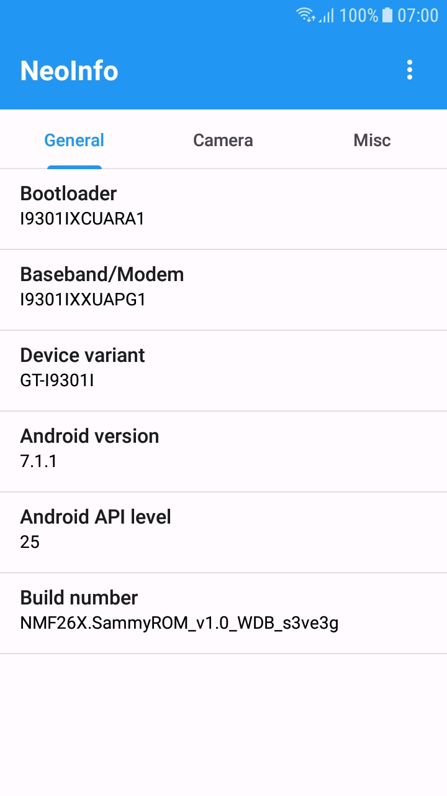
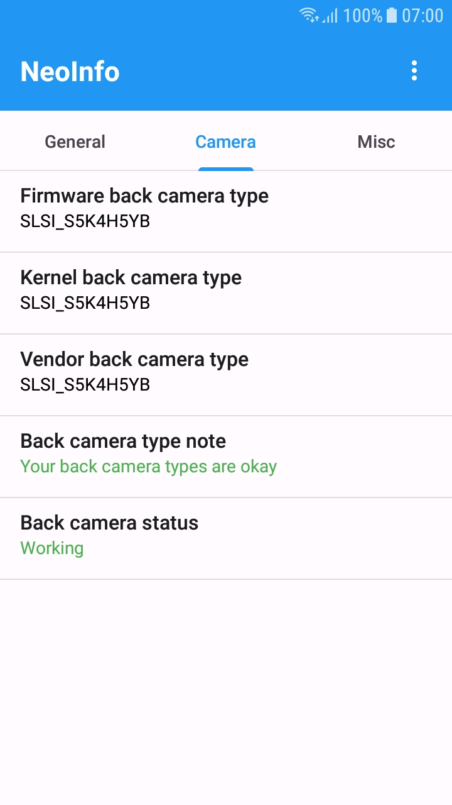
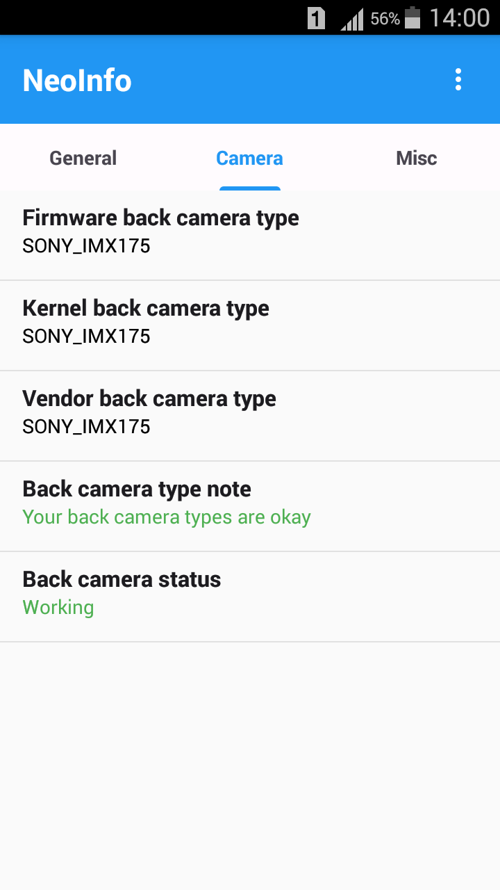

# NeoInfo

NeoInfo is a tool for the [Samsung Galaxy S3 Neo](https://en.wikipedia.org/wiki/Samsung_Galaxy_S_III_Neo) 
which aim to figure out the bootloader, modem and camera sensor of the device. 
Those information are the most important prerequisites for modern Custom ROMs. 
Additionally it displays some more or less important information such as the 
current CSC, front cam type and more.

## Screenshots
  

## Download

## License

NeoInfo is licensed under the [Apache License, Version 2.0](https://github.com/prototype74/NeoInfo/blob/master/LICENSE)
